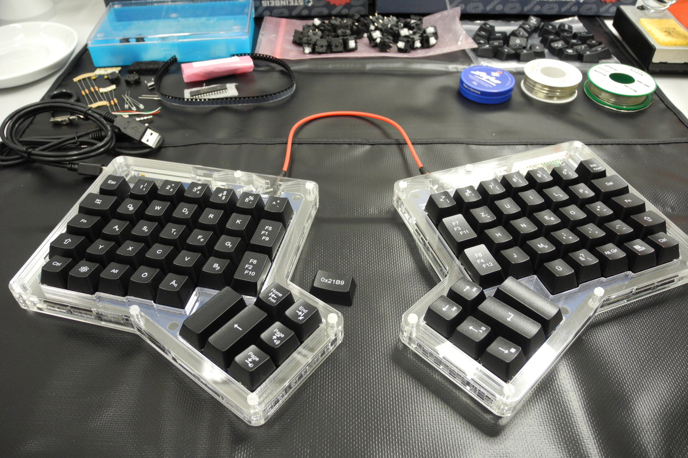

# Ergodox Keyboard

Final result: ErgoDox keyboard with Minimak-8 layout, Cherry MX clear keys and leather wrist rests.

# Touch typing needs ergonomic keyboards

Although I'm a computer nerd since the age of 12, I never learned to touch type properly. The reason was not that I could not learn it but that it did not made any sense to me on a standard keyboard. Normal keyboards are still staggered alike type writers in the 1860s because of the cultural lag. Applying the common touch typing method would mean a both unnatural and unhealthy twisting of the hands and fingers [[ref](https://www.trulyergonomic.com/store/image/data/Staggered_ergonomic_keyboards.jpg)]. Every time I convinced myself to start a touch typing tutorial I ended up swearing at the big companies for their inability to allow new standard and returning to my 4 finger-search-approach. This happened last in December 2013, but this time the threshold was afterwards way lower (both for technical and economical reasons) to dive into the [www.geekhack.com](www.geekhack.com) community, and join a project on a custom keyboard!

# There is no such thing like an ideal keyboard

Except for some [crazy Japanese](http://xahlee.info/kbd/Japan_M-Type_TRON_keyboards.html) products there are only the [Typematrix](http://www.typematrix.com/), the [Maltron](http://www.maltron.com/)/[Kinesis](https://www.kinesis-ergo.com/shop/advantage-for-pc-mac/), and [Truly-ergonomic](http://www.trulyergonomic.com/) keyboards that offer ergonomic key arrangements. For me all come with disadvantages in price, options to customise, or considerable flaws in the design. On geekhack, however, the ErgoDox platform was developed and pushed by a couple of people with the same thoughts and reached a level where the PCB and a case have been designed, tested, and made public domain. Advantages are that the hardware and the firmware can be adapted easily, the keys are mechanical cherry keys, and the two parts for both hands can be placed at will. This includes to use any layout I prefer.

Some companies already included both, the board and case, in their shops and all electronic parts including the [teensy](http://www.pjrc.com/) board and [cherry mx clear](http://deskthority.net/wiki/Cherry_MX_Clear) are available partially via Reichelt and others. In sum, this means all parts can be obtained for reasonable prices and the keyboard needs soldering and assembly, but this is easy and fun. I ended up, acquiring a complete ErgoDox set at [Massdrop](https://www.massdrop.com/buy/ergodox) (actually 2 sets for 200$ each in April 2014).

Most of the parts (photo by massdrop.com).

# Custom keycaps

For the keycaps I found the option at WASD Keyboards [http://www.wasdkeyboards.com/] to get my own layout printed on UV coated ABS keys [http://deskthority.net/wiki/QWERkeys_UV_printing]. The keycaps were offered in DCS family and come with the same quality and durability [http://keycapsdirect.com/key-caps.php] of standard IBM keyboards with ergonomic sculpturing. Compared to PBT, which is the most sturdy and resistant polymer you can get for keycaps, ABS is more "flexible and less brittle" [http://deskthority.net/wiki/Keycap_construction], but the UV coating give both, the ABS and the printing a cover that will last forever. From my opinion the polymer development is the greatest technological improvement of mankind in the last 20 years. You can contact me, if you want to start a discussion on that.

 
Left-over keycaps. Printing full 104er sets was most cheap, therefore I prepared a lot more keycaps for alternative layouts. If someone wants a keycap: let me know!

# Assembling the ErgoDox

It took Massdrop nearly three months from order to delivery, but in April 2014 I had all parts together and was able to build my keyboard (two sets)! The process took me around four hours for each set and went fine. The only technique I had to learn was to solder surface-mount diodes with a contact size of less than one mm². The trick is to put a small drop of tin solder on one of the plates on the PCB, let it solidify and then put the diode with tweezers on the drop and re-heat it. Working with the teensy board and the USB connectors was very easy too, thanks to the very good [assembly instruction by Massdrop](https://www.massdrop.com/ext/ergodox/assembly.php).

# Some words on the layout

A very important aspect when you start touch typing from scratch is to think about the layout. [QWERTZ](http://deskthority.net/wiki/Keyboard_layouts#The_QWERTY_layout_.281873.29) is around since ever (cultural lag again), but is by far not optimal. A good layout should allow you a) to have a good and balanced employment of all fingers with a small bias to you middle finger, b) to type most -used bi-grams easiest, and c) to have both a and b be grounded in the statistical distributions of letters and words in the used language(s). Since QWERTZ is really sub-optimal in these criteria, people made an effort to offer better layouts. The notable examples for this are the [Dvorak](http://deskthority.net/wiki/Keyboard_layouts#Dvorak_.281936.29) layout for English and the [Neo](http://neo-layout.org/) layout for German. However it is debatable to switch to one of these extremes for three reasons: 1) at the moment I have a good mixture of English and German writing, 2) still, the standard keyboards with QWERTZ are around and I maybe want to be able to type with them - if necessary - also in the future, and 3) although I did not touch type before, I have a good motor memory of the movements for most of the keys in the QWERTZ layout and it's maybe hard to unlearn that. My solution in the end was to use a "German" [Minimak-8](http://www.minimak.org/) layout with a number of [adaptations](http://www.keyboard-layout-editor.com/#/layouts/369ce0adde1387e92d1df14065be2571) to account for the German Umlaute and special characters. Minimak-8 is a layout that differs only in the 8 most crucial letters from QWERTZ towards Dvorak and brings already "75%" of the improvement (scientific evidence not available). A very nice thing with your own custom firmware is that you easily can also implement a second "shift" key (mod) to use characters that are usually done via alt-gr as well as additional ones (all Greek letters for my diss!). of course this is quite normal within the advanced keyboard community (e.g. Neo is designed with up to 6 layers (4 mods)), but needs some creativity when squeezing it into a USB-keyboard protocol.

My final layout.

# Firmware

Speaking of it, next I needed to develop the software for my keyboard. With the teensy board the keyboard has a controller that copies the controller of the widely used USB keyboards and can use the same protocol. I based my firmware on the implementations of [benblazak](https://github.com/benblazak/ergodox-firmware) and added special media keys based on the specifications of the [USB HID protocol](http://www.usb.org/developers/hidpage/). My keyboard includes some very uncommon key arrangements like having three Fx, x=1..12 keys in one physical key, made available by shift and the second mod. Works great so far!
Training touch typing from scratch

All this done I am able to learn touch typing and benefit from this device for daily work and gaming. The best tool I found was the [Tipp10](https://www.tipp10.com/de/) framework, developed by a German enthusiast as his final Diplom project. The software offers to learn online or offline with any predefined or self-made training data. I also ended up joining the current team as a spare-time-developer to contribute the Minimak layouts and training material. The training itself indeed took some time: I did round about 25 lessons, each 3-4 times a 5 minutes plus overhead - 8h of my life, "just" to learn to type. And in addition: the first two months of fully employing the new keyboard were hard and demanded discipline. I am happy that I have done this!

# Cosmetics for the enthusiast

- Anodised aluminium top plates for the ErgoDox (already used in the picture above). 
- Wrist rests: also via geekhack I found [Noko](http://store.noko.ca/), a Canadian leather craftsman. Somewhere in the last year she started to build a model for rests that would fit the ErgoDox perfectly and can be made in every custom appearance (made by hand, of course). This includes engravings as well as custom colours and resulted in these pieces of art:

# Conclusion

This endeavour was expensive and time consuming in many aspects like research, assembly, development, and learning, but it was worth it! I can touch type with all its advantages - like concentrating more on the text that I write or reading while typing - and can type overall considerably faster (last measurement gave me 54 wpm on English and 50 wpm on German text) as well as make much less errors (measured 5-10% word error rate previously and 1-2.5% now) than before. Also the mechanical keys feel so much better in precision, reliability, and coherence. It's safe to say:

I improved my skills, chances to stay healthy, and my style for both, working and gaming and can proudly claim: this is my keyboard!

 My set for the office: clean and solid.
 The gamer's set: convenient with a gorily touch.
